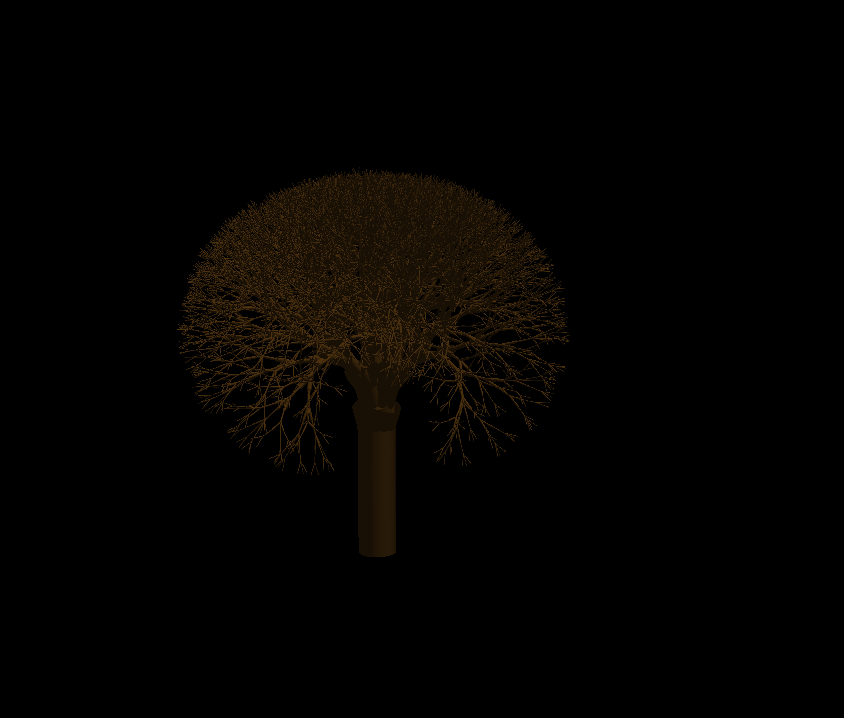
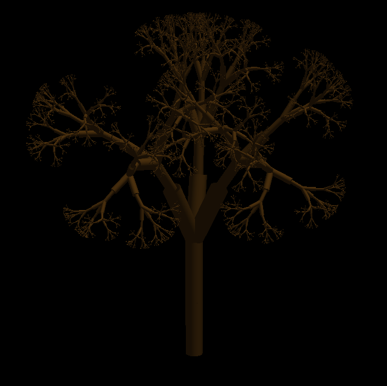
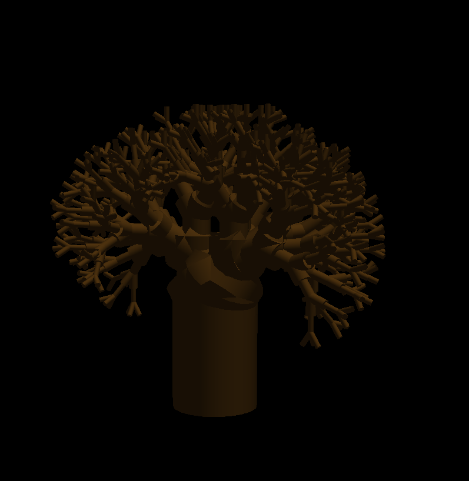
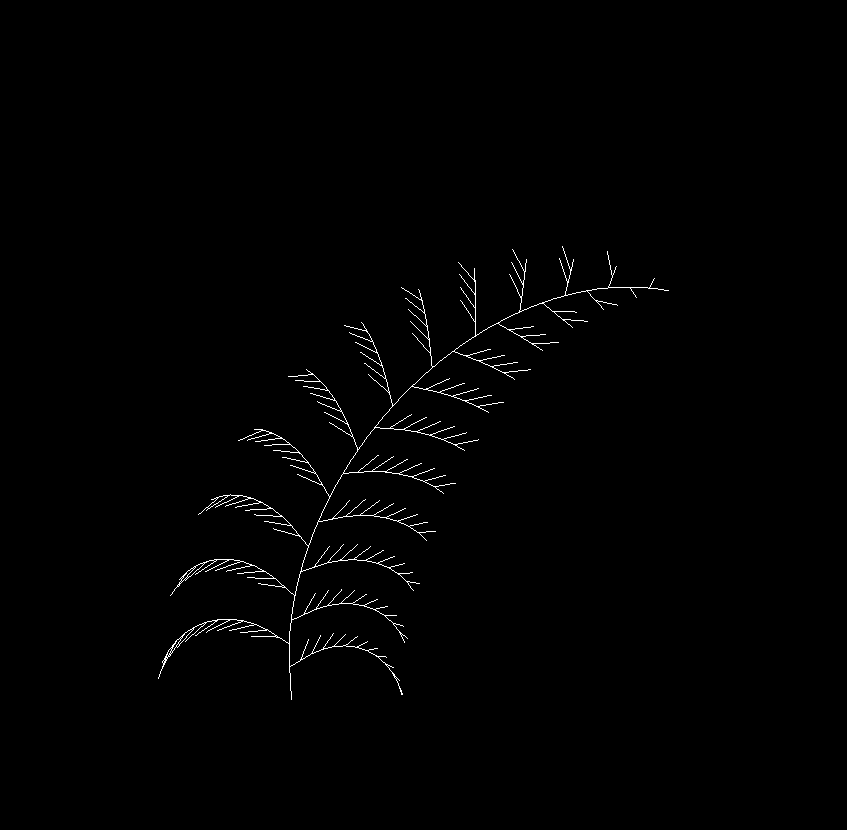
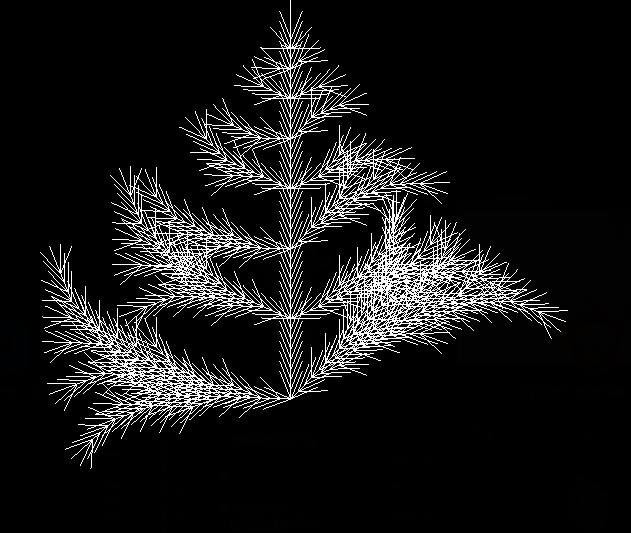
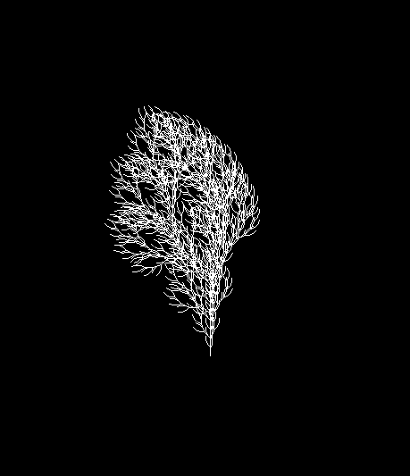
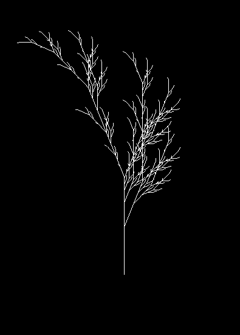
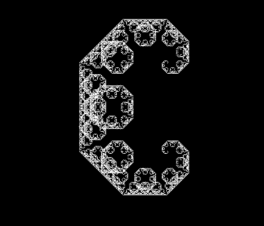
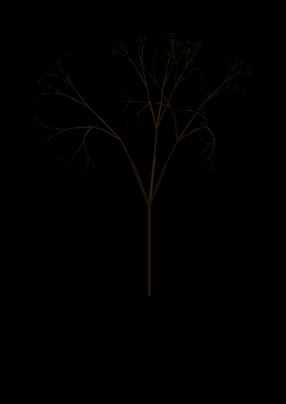
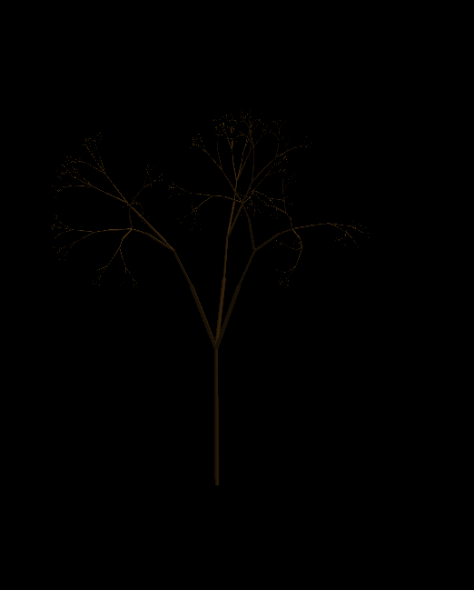

# Dany's L System Generator
A custom L system generator and Parser/Renderer. This is built in C++ and openGL.

The engine interprets a **formal string-rewriting grammar** to procedurally generate complex organic structures, utilizing a custom parser to evaluate parametric and stochastic production rules.

## Examples

| Feature Showcase | Preview |
| :--- | :--- |
| **3D Parametric Generation** |  |
| |  |
| |  |
| **2D L-System Capabilities** |  |
| |  |
| |  |
| |  |
| |  |
| **3D Stochastic Behavior**  These are made with the same System |  |
| |  |
## Features

### Generation Methods

- Stochastic
- Parametric
- 3D
- 2D

### Organic Behavior
- Tropism
- Quaternion-based Turtle Rotations
- Surface-Alignment

### Key Rendering Implementations
- GPU Instanced Cylinder Rendering
- Modern OpenGL Pipeline (VAO/VBO Buffer Management)

### Future Ideas
- Make a forest of trees
- Add leaves so the trees are not all dead XD

## Learn More!

This is where I learned and got inspiration for this project! (The rabbit hole is deep, and this just touches the surface)

https://algorithmicbotany.org/papers/abop/abop.pdf